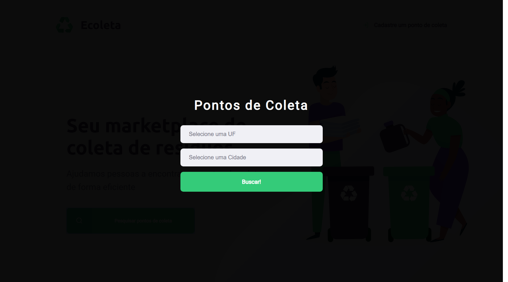

# Repositório de Treinamento

Repositório destinado ao workshop Next Level Week#01, sobre TypeScript, Node, React e ReactNative realizado pela **Rocketseat**.

# Sobre o Projeto

O Ecoleta é uma aplicação onde usuários podem cadastrar pontos de coleta e/ou encontrar o destino correto para determinados tipos de lixo:
- Lâmpadas
- Pilhas e Baterias
- Papéris e Papelão
- Resíduos Eletrônicos
- Resíduos Orgânicos
- Óleo de Cozinha

## Tecnologias 
### Aplicação Back-end (server)
A aplicação back-end foi desenvolvida com as seguintes tecnologias:

- TypeScript
- Node
- Celebrate
- Cors
- Crypto
- Express
- Knex
- Multer
- Sqlite3

### Aplicação Front-end (web)
A aplicação front-end foi desenvolvida com as seguintes tecnologias:

- TypeScript
- React 
- React Dropzone
- React Icons -> Feather Icons
- React leaflet
- Leaflet
- Axios
- React Router Dom

  
  
  
  
  
  

### Aplicação mobile
A aplicação mobile foi desenvolvida com as seguintes tecnologias:

- TypeScript
- React Native
- Expo
- React Navigation Native
- React Native Gesture Handler
- Axios
- React Native Picker Select
- React Native Maps
- React Native Svg 
- Expo Constants
- Expo Location
- Expo Vectors

  
  
  
  

# Publicação e Acesso
Todo conteúdo aqui publicado é resultado do workshop realizado por meio da plataforma virtual  da **Rocketseat** disponível [aqui](https://rocketseat.com.br/).
